# Hostel-Management-System
Hostel Management System is a web based application desgined to manage activities of hostel.The application provide facility of maintaining all data related to students using admin panel. The students using login details can log into the application and can take benifit of various facilities online.
# Key Features:
1. Seperate Admin and Student Panel
2. Dynamic News Updation for students
3. Mail facility 
4. Online hostel leave request
5. Fee Status
6. Emergency Information etc.
# ScreenShots:
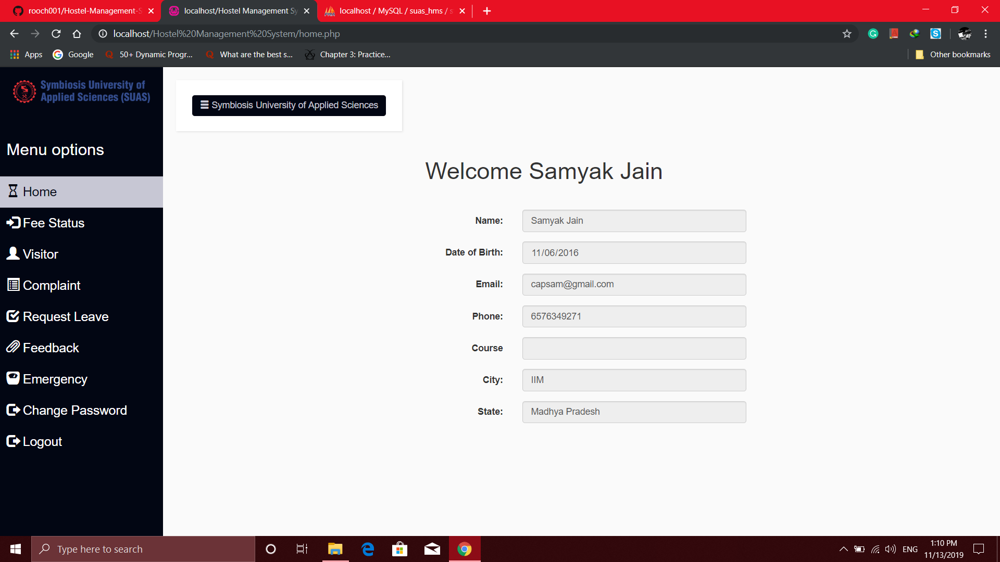 
 
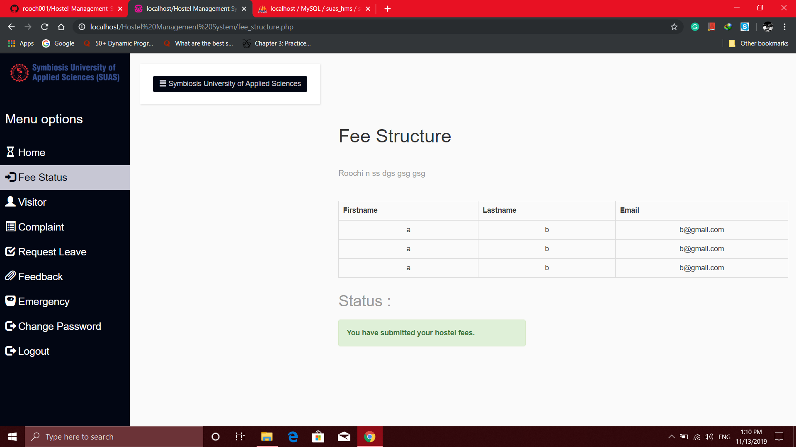 
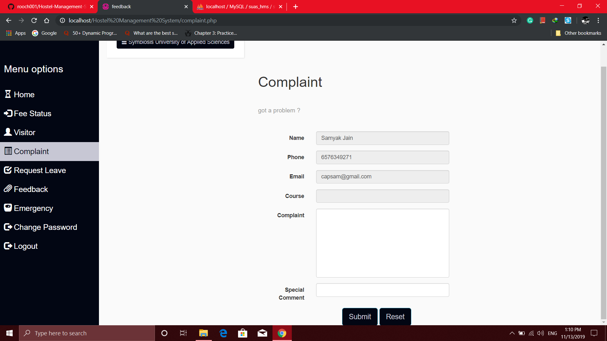 
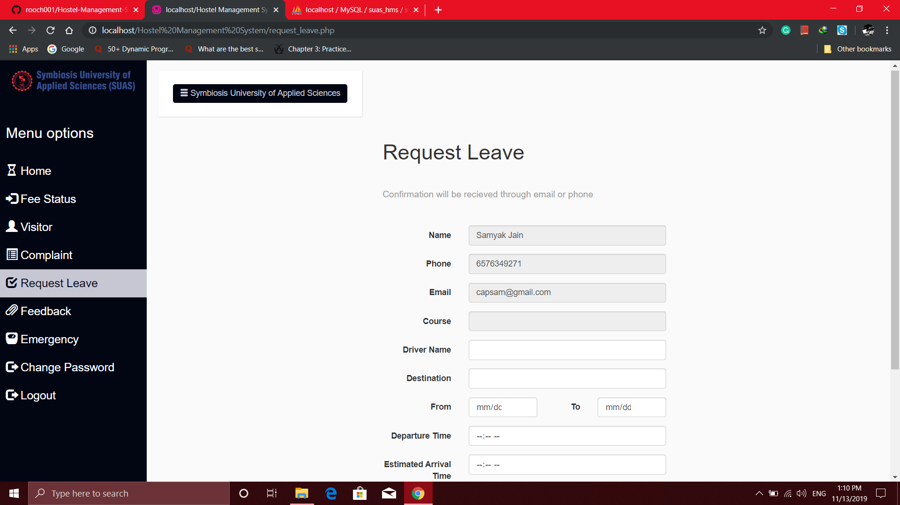 
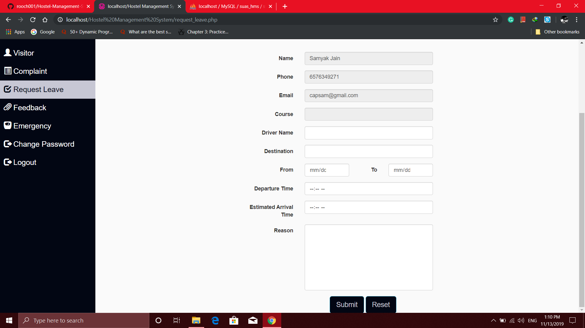 
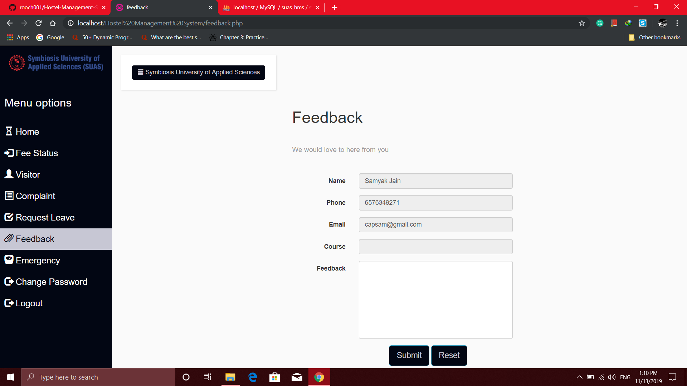 
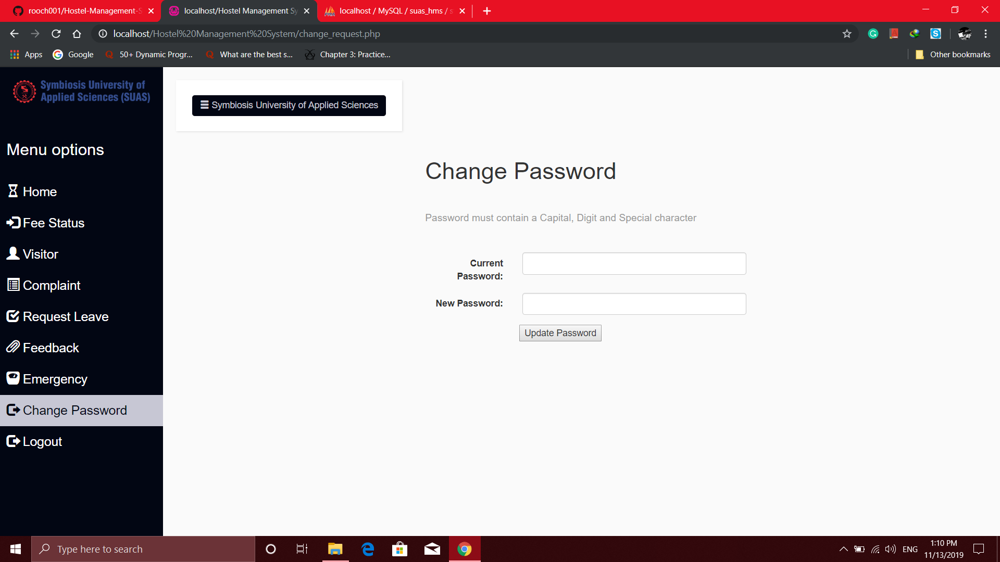 
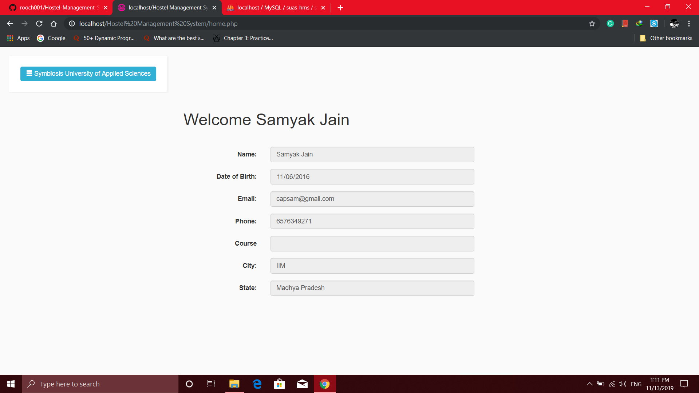 
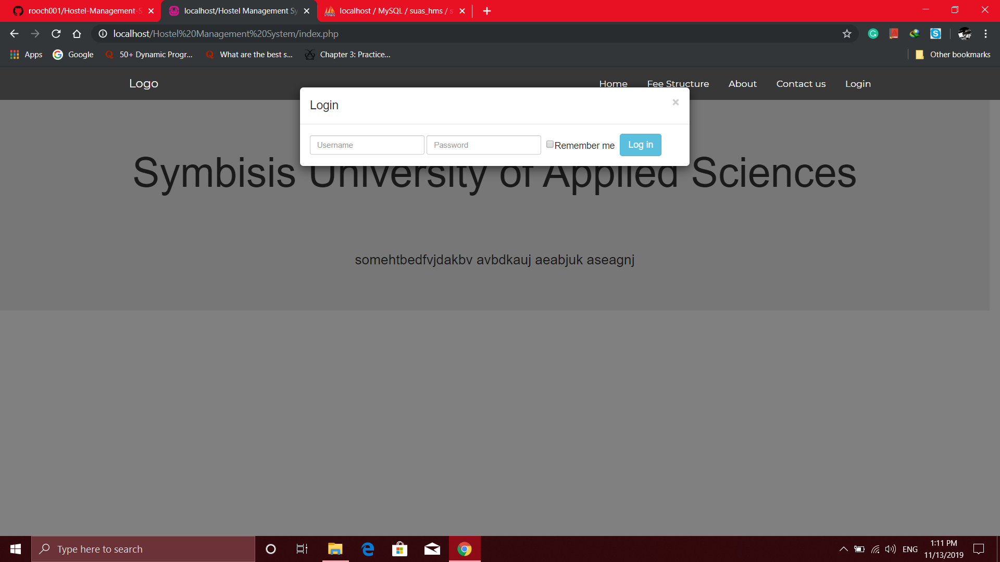 
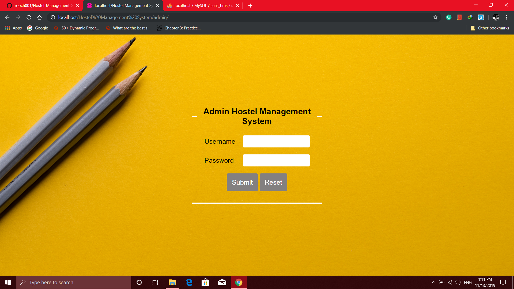 
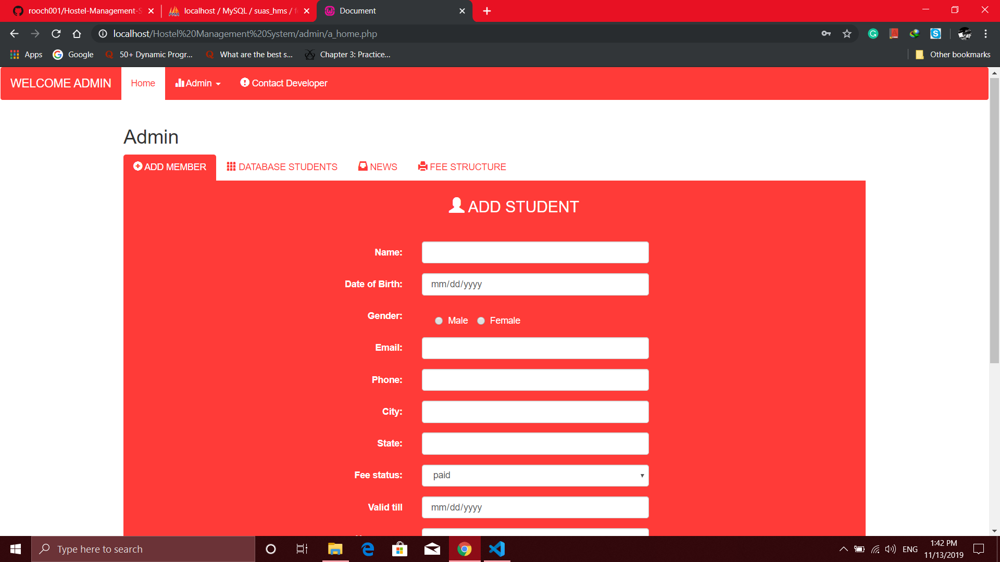 
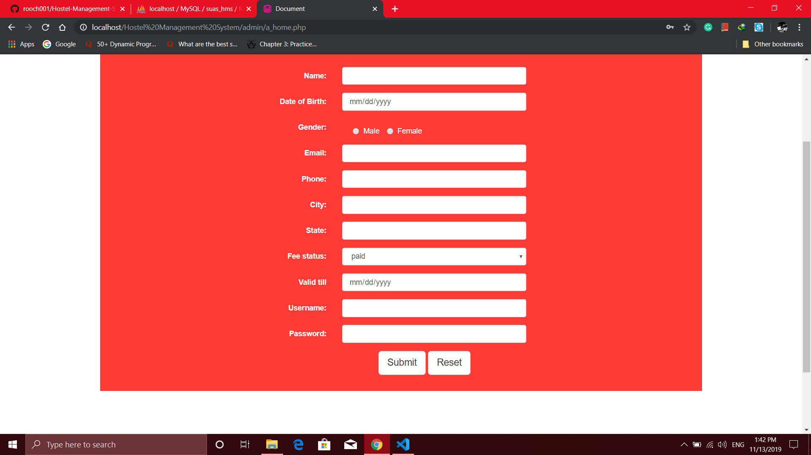 
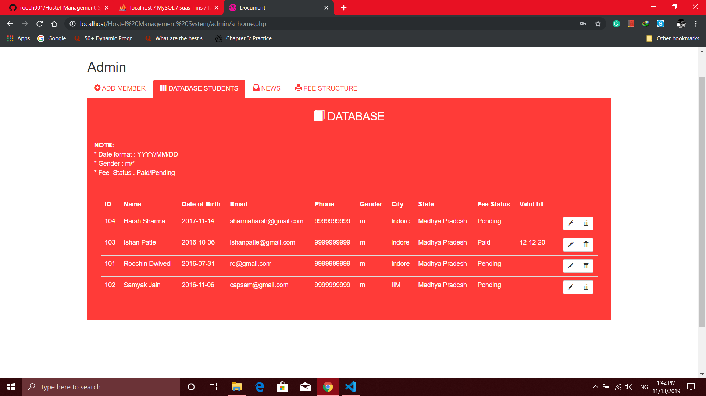 
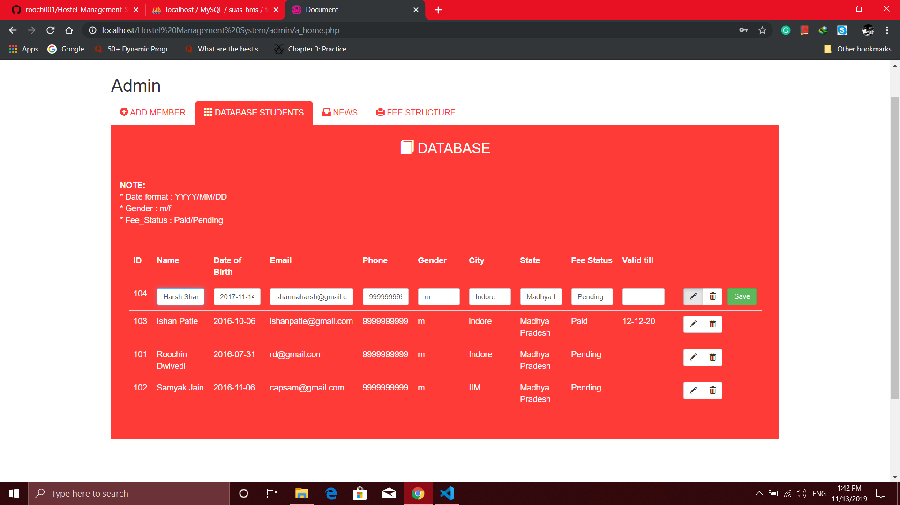 
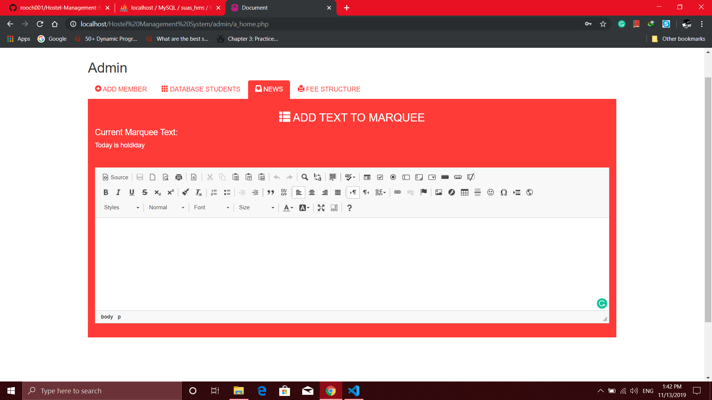 
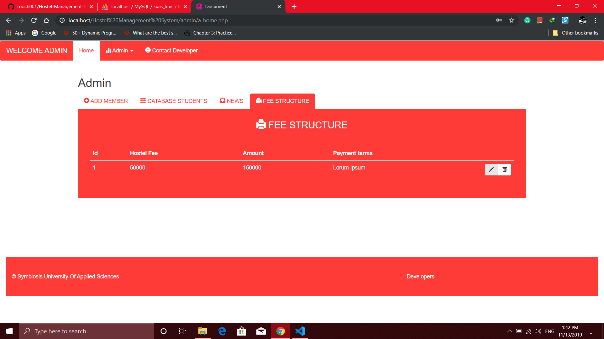 
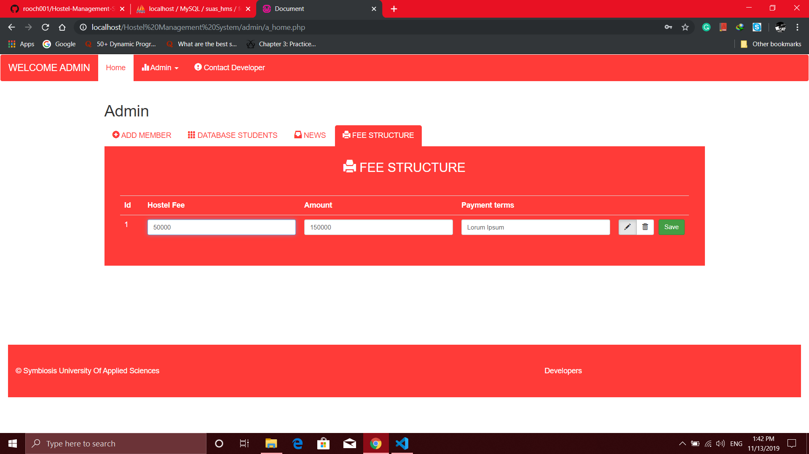 
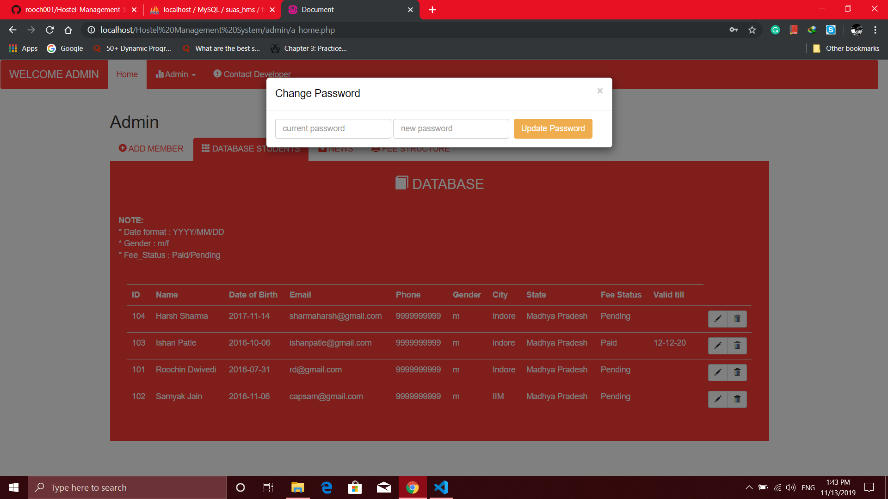 

